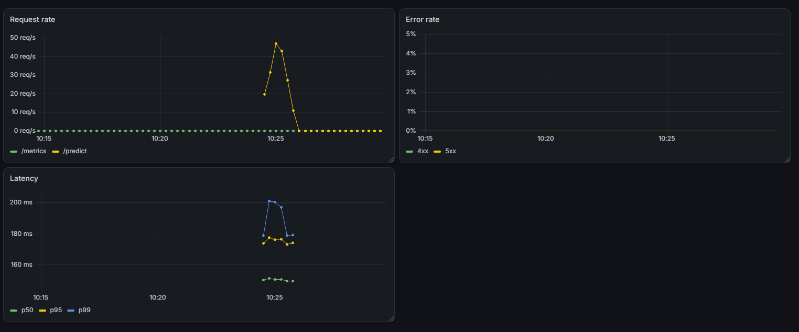
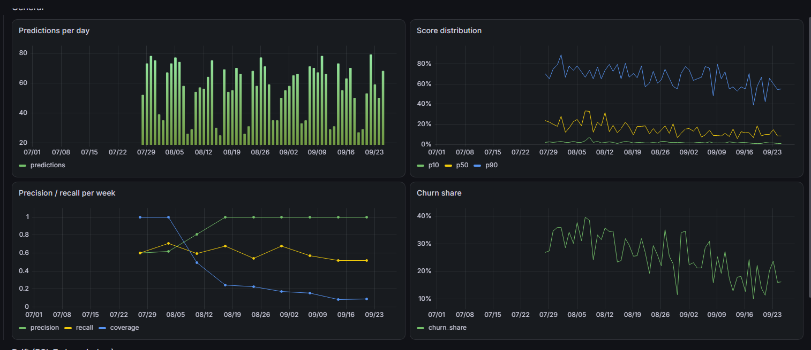
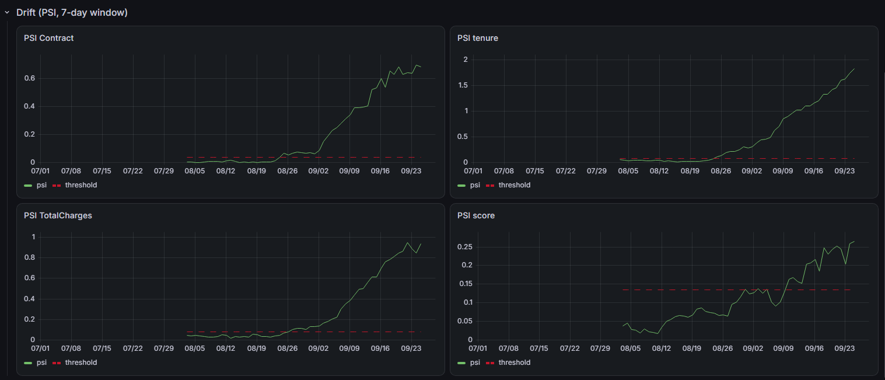

# Churn scoring service

A churn scoring service for the Telco Customer Churn dataset. It trains a
model, promotes it through an MLflow registry, and serves it over a FastAPI endpoint that
returns a churn probability, a decision and the model version and threshold behind it. Every
prediction is stored, incoming traffic is monitored for drift, and predictions are reconciled
against labels once they arrive. Prometheus and Grafana dashboards over both the service
and the model.

## The problem: the truth arrives late

When a churn model says a customer will leave, the label comes weeks or months later, so
accuracy cannot be monitored in real time. The system is therefore built around two things:
monitoring **proxies** (are incoming features still like the training ones? are scores
drifting? is the positive rate stable?) and keeping every prediction with an identifier so
that labels, when they arrive, can be **reconciled** with the predictions made at the time.

## Dataset

Telco Customer Churn (IBM sample, ~7,000 rows, 26.5% churn).

## The split

Customers with `tenure >= 60` months are held out entirely and kept intact as a reserve of
traffic to replay later, so the drift monitor faces a **real subpopulation shift**. 
Cost: 22% of the rows but only 5.7% of the positives, because long-standing
customers churn rarely (6.7% vs 31% elsewhere).

The rest is split `train` / `val` / `test` / `eval_frozen`, stratified on the target.
`eval_frozen` is reserved for the regression gate. `test` doubles as the pool of "normal" traffic for the monitoring demo. The output is a manifest (`customerID` → split) versioned in the repo

```
python -m src.data.make_split
```

## One path from raw record to score

Preprocessing and model are a single serialisable `Pipeline`, so there is exactly one
implementation of the path from a customer record to a probability.
`tests/test_pipeline_skew.py` asserts it.

## Metrics

- **PR-AUC (average precision)** compares runs and guards the regression gate. Threshold-free,
  and it carries its own floor: a random model scores the prevalence (~0.31). 
- **Recall at a precision floor of 0.60** is the operational figure. The floor is a stated
  assumption, *at most 40% of retention contacts wasted*.

The floor was raised from 0.50 after measuring what it implied: 0.50 flags 51% of the customer
base, and the contacts gained by lowering the floor from 0.60 to 0.50 are useful only 30% of
the time, below the constraint the policy claims to enforce.

## Four comparable runs, one promoted version

Runs are tracked in MLflow (SQLite backend, required for a database-backed registry), with
parameters and metrics kept separate. On the validation split:

| run | PR-AUC | recall at operating point |
|---|---|---|
| logistic regression | 0.649 | 0.643 |
| logistic regression, balanced classes | 0.647 | 0.643 |
| gradient boosting | 0.671 | 0.647 |
| **gradient boosting**, `max_depth=5` | **0.687** | 0.635 |


These are validation numbers, measured on the split the threshold was chosen on, so they are
optimistic by construction. Honest operational figures come from applying the threshold to
`test` once, at the end.

## The service

FastAPI, model loaded **once at startup** via the lifespan. When `MODEL_PATH` is set it reads the model shipped inside the image, otherwise it asks the registry for `models:/churn-classifier@champion`.

`/healthz` returns 200 while the process is alive; 

`/readyz` returns 503 until the model is
loaded, and if loading fails the service **starts anyway** and stays not-ready.

`/predict` is declared `def`, not `async def`, on purpose: inference is a blocking call and on
the event loop it would stall every concurrent request. FastAPI runs a sync endpoint in a
threadpool instead. The request schema is the contract in executable form.

### Every request carries an identifier

Each request gets an id, the caller's `X-Request-ID` or a fresh uuid, returned in a header
and written to both tables. It is assigned in **middleware**, so a request
rejected by validation has one too.

One JSON log line per request, at the end (id, path, status, duration).

### Every prediction is kept

Each answer is written to Postgres **before** it is returned: request id, customer id, the 19
input features, score, decision, threshold applied, model version.

- **Two timestamps.** `created_at` is when the service produced the answer; `event_time` is
  when the prediction is considered to have happened (caller-supplied, defaulting to now). The replay
  harness compresses 60 simulated days into two minutes of wall clock, and every window, drift
  comparison and maturing metric is computed on event time.
- **Append-only.** A prediction is a fact that happened; the label that arrives later is
  another fact in its own table. Overwriting would destroy what was known at decision time.
- **Threshold and decision are stored even though derivable**, because the table records *what
  was answered*, not what could be recomputed. If a tag is edited or the rule changes, old rows
  still tell the truth.
- **Write-before-answer; a failed write fails the request (500).** Answering 200 and logging
  the error would produce predictions invisible to every monitor and future reconciliation.
  The observability the service exists for would degrade in silence.

### Telemetry: a second table

`request_log` records *how long it took*, one row per request from the middleware (method,
path, status, total + three phase durations).

### Tests

Split by what they need to run. Contract tests need neither model nor database (validation runs
before the endpoint body) so they work anywhere, CI included. The integration test asks the
registry which version is champion, replays a row of that run's verification sample over HTTP,
and checks both the score and that the row landed in the table. Its expected value is read
from the registry, so promoting a new model does not turn it red.

## Running in a container

```
python scripts/fetch_model.py
docker compose up --build
```

The image contains the model. `fetch_model.py` resolves the alias to a **version number**
once, downloads that version's artifact into the build context, and writes a metadata file
(version, threshold, run id); the build copies both and sets `MODEL_PATH`.

**cloudpickle, not skops.** skops validates every type it deserialises instead of executing it;
measured startup was 1.3s to download the artifact and **53s to deserialise**. 
Cloudpickle stores functions by reference, so the loading process must be able to import
`src.inference.pipeline`, the source has to ship next to the artifact.

## Continuous integration

```
.github/workflows/ci.yml
```

Two jobs, answering different questions. `checks` runs ruff and the test suite. `gate` retrains the served configuration from a clean clone and evaluates it on
`eval_frozen`. The gate can run from scratch because nothing
it needs lives on a developer's machine: dataset from the pinned URL, split manifest in the
repo, model retrained rather than fetched.

**The gate threshold is measured, not picked.** `eval_frozen` is 695 rows, so PR-AUC on it is
an estimate with a width. A bootstrap (1000 resamples, fixed seed) puts the 95% band at
**[0.645, 0.775]** around a point estimate of 0.7145, differences below ~0.065 carry no
information. The gate sits at **0.64**, just under the lower edge; `python -m eval.run_gate
--bootstrap` reproduces it. A tighter gate would fire on noise. Stated consequence: a model that genuinely degraded to 0.67
would pass, the cure is a larger evaluation set, not a stricter number. So the gate is first
of all a **breakage detector**: real regressions move PR-AUC by 0.1–0.3, not 0.02.


## Replaying traffic

```
python -m scripts.simulate_traffic --reset
```

The dataset has no dates, so the timeline is constructed: 60 simulated days, 25–80 requests a
day with lighter weekends, each carrying its own `event_time`. Twenty days of baseline, then a
ramp where the share of customers drawn from the held-out `tenure >= 60` segment climbs to 70%.
Normal traffic comes from `test`. The
realised daily share wanders ±0.1 around the intended one. Re-running
refuses to append unless `--reset` is passed.

## Where the time goes

Percentiles come from `request_log` in SQL (`sql/latency_percentiles.sql`), computed with
`percentile_disc` and restricted to
successful requests.

Median milliseconds, ~3,200 requests per run:

| | pipeline alone | 1 request at a time | 8 concurrent |
|---|---|---|---|
| model pipeline | 3.5 | 4.4 | 89.3 |
| database write | — | 1.2 | 4.4 |
| everything else | — | 1.3 | 52.6 |
| **service work** | — | **6.9** | **146.3** |
| waiting for the caller | — | 41.9 | 3.4 |
| **total** | — | **48.9** | **149.9** |

- **The model is not the bottleneck.** Scoring one record costs ~4 ms.
- **Under concurrency, 95% of the time is contention.** Service work goes 6.9 → 146 ms for the
  same work: the workload is Python-bound.
- **Instrumentation boundaries decide what is visible.** The ~42 ms of waiting for the caller
  sits inside the first measured phase at low concurrency and vanishes at high concurrency
  (that wait happens before the first timer starts).

Two notes: the first call after startup costs 43.8 ms vs 3.5 (a warm-up prediction at startup
would absorb it) and all figures come from one laptop running service, Postgres and load
generator together, they measure the *composition* of the time honestly, not its absolute
value.

## The same latency, 2 ways to mesure it

SQL percentiles are exact but available only because one service writes to one table.
Usually we cannot do that, so the service also exposes `/metrics` and a Prometheus
container scrapes it. Two metrics only: a request counter by path/status and a latency
histogram. Model metrics stay in SQL, because Prometheus only scrapes periodic snapshots of
aggregates.

A histogram stores counts under each bucket threshold, so `histogram_quantile` interpolates
inside the bucket the percentile lands in; the error is bounded by that bucket's width. On the
same traffic:

| p99 of `/predict` | |
|---|---|
| exact, `percentile_disc` in SQL | 177.03 ms |
| estimated, `histogram_quantile` in Prometheus | 179.79 ms |
| difference | +2.76 ms (1.6%) |

That 1.6% measures the **bucket configuration**, buckets here were placed
around the measured distribution (dense 30–250 ms). The library defaults jump from 100 to 250 ms and
would land the p99 in a 150 ms-wide bucket. Both are kept
because exact percentiles do not **compose**: bucket counts from ten instances sum to a correct
global p99, ten exact p99 values cannot be averaged into anything.

## Catching the shift

```
python -m scripts.compute_drift      # writes drift_metrics
sql/drift_psi.sql                    # reads it
```

Each window is compared against a reference with the **Population Stability Index**: bin the
reference, measure how much probability mass moved between bins, weight by the log ratio. One
number per feature, the same formula for numeric (quantile bins fixed once on the reference) and
categorical (one bin per level). **Not a statistical test, on purpose:** a KS/chi-square
p-value answers *is there a difference*, not *does it matter*, and with a few thousand rows
every difference is significant. PSI answers how much moved.

The reference is `val`, data from the training population the model has **not** seen.

### The threshold

**The noise floor is a property of the binning, not the data.** With 11 bins and ~50 rows/day,
a day of perfectly normal traffic scores PSI ≈ 0.2, above the 0.25 "significant" rule of
thumb. The floor scales roughly as `(k-1)/n`: 11-bin numeric features sit at ~0.2, 2-bin
binaries at ~0.005 on the same traffic. So the window was widened to **7 days**: the floor drops with more rows per bin, and a week contains exactly one
weekend, so the weekend effect stops pulsing weekly.

| `tenure` | 1-day window | 7-day window |
|---|---|---|
| worst quiet-period PSI | 0.479 | 0.082 |
| typical PSI during the shift | 0.781 | 0.543 |
| separation | 1.6 | **6.6** |

The widening cost a little signal but bought a floor six times lower, and it detects **earlier**
(`tenure` at day 31 vs 35): the threshold to clear drops faster than the signal smooths.

**The alert line comes from the shape of the quiet distribution**, `p50 + 3 × (p95 − p50)` per
feature. The `false_alarms` column in `sql/drift_psi.sql` counts quiet-period
crossings and must be zero. The multiplier 3 is a choice; PSI has a known null distribution
(`n·PSI` ≈ χ² with `k−1` df), which is where the line would come from with enough data for a
stated false-alarm rate. There is **no "two windows in a row" rule**: consecutive 7-day rolling
windows share six days, so one odd day appears in seven of them.

### What it caught

Zero false alarms across all 19 features over 20 quiet days at 7 days. The 1-day series
produced one, on `gender`, the natural negative control, since the held-out segment has the
same gender mix, so any alert on it is by definition the monitor being wrong.

| | day | held-out share of traffic |
|---|---|---|
| first feature to cross | 27 | 12.9% |
| six features agreeing | 33 | 31.2% |
| `tenure`, the variable that actually changed | 31 | 24.2% |
| the **score** distribution | 44 | 60.0% |

### What this monitor cannot see

PSI per feature compares **marginal** distributions, one variable at a time. It is blind to a
change in joint structure, to
movement inside a bin and above all to **concept drift**. `P(x)` identical while `P(y|x)`
changes.

## Waiting for the truth

```
python -m scripts.simulate_labels --reset   # writes labels
sql/reconciliation.sql                       # reads them
```

Churn labels arrive months after the prediction. Everything here follows from one assumption:
an **observation window of 90 days**, after which a customer who has not left is declared
retained. So a churner's label lands 1–90 days later, a
non-churner's only when the window closes at day 90. `available_at` says when each would
have been knowable, and every query filters on an `as_of` date. Predictions whose label is not
yet revealed are not counted as wrong, they are not counted, which is what coverage reports.

### The same week, from six vantage points

393 predictions from one baseline week, judged at increasing distances:

| days later | coverage | positive share of labelled | precision | recall |
|---|---|---|---|---|
| 7 | 4% | 1.000 | **1.000** | 0.438 |
| 21 | 10% | 1.000 | **1.000** | 0.610 |
| 45 | 17% | 1.000 | **1.000** | 0.631 |
| 70 | 26% | 1.000 | **1.000** | 0.604 |
| 90 | 100% | 0.331 | **0.568** | 0.608 |

Same predictions, same code, six dates. **Precision reads 1.000 against a truth of 0.568**, because for 70 days the labelled sample contained nothing but
churners, so a flagged non-churner could not yet be contradicted. **Recall matures in three
weeks, precision in three months:** from day 21 recall is within 0.003 of final, because its
denominator is the positives and positives resolve quickly. Operational rule: on a fresh window,
recall can be read and precision cannot. This is why a quality metric is dated to the day of the
**prediction**, not the day it was computed and why every point needs its coverage beside it,
without that column the 1.000 is indistinguishable from a real one. (Simplification: coverage
jumps 26% → 100% because every negative resolves on exactly day 90; a real per-customer window
would make the curve smooth.)

### Did the shift actually hurt the model?

With every label revealed, before and after the ramp:

| | prevalence | precision | recall |
|---|---|---|---|
| baseline | 0.314 | 0.593 | 0.646 |
| after the shift | 0.224 | 0.582 | 0.618 |

Differences of 0.011 precision and 0.028 recall on samples of one and two thousand rows: inside
the noise. Inputs moved a great deal (PSI on `tenure` six times its quiet ceiling) and quality
held. The monitor
was right to fire on day 27, and the right response was to investigate, not retrain. A pipeline
that retrained itself on the alarm would have replaced a model that was working. It is the
concrete reason the loop is deliberately left open, with a human between alarm and action. It
also closes the metrics account: the operating point set on validation to hold precision at 0.60
delivers 0.659 on `eval_frozen` and 0.593 on baseline traffic, the constraint holds
approximately, the honest version of holding.

## Two dashboards, because there are two clocks

```
docker compose up          # Grafana on :3000
```

Grafana is provisioned from files (`grafana/`), dashboard JSON committed alongside. There are
**two** dashboards because Prometheus records real time (the minutes the replay ran) and the
tables record event time (60 simulated days); one time picker cannot mean both, so a single
dashboard would always have half its panels empty.

**Service** reads Prometheus on real time: request rate, error rate by status class, latency
percentiles. 

**Model** reads Postgres on event time: predictions per day, share of `churn`
decisions, score distribution as p10/p50/p90, PSI per feature with its alert line, and precision
and recall by prediction week **with coverage beside them**.






## Limits

- The dataset has no timestamps, so the timeline is simulated. The shift is real data; *when* it
  arrives is a design decision.
- Latency was measured with service, DB and load generator on one laptop.
- Drift thresholds rest on 14 quiet windows and the margin multiplier is chosen, not derived from a stated false-alarm rate.
- Cost per request is not estimated; at this volume it would be dominated by an idle instance.
- The served model was selected among four variants on validation, and their spread (0.649–0.687)
  is well inside the ±0.065 noise band later measured on `eval_frozen`. It is therefore **not
  established** that the promoted gradient boosting is actually better than the logistic baseline;
  it won the declared metric, which is a weaker claim.
- The operational numbers are optimistic until measured on `test`.
- Label arrival uses a single fixed observation window, so every negative resolves on the same
  day and the coverage curve steps rather than climbing.
- Neither a fresh clone nor CI can build the image: `fetch_model.py` resolves the champion alias
  against a registry that is a local SQLite file. The limitation is the registry being *local*.
- The raw dataset is not stored here, so training and the gate need network access.


